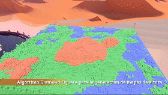

# Generación Procedural de Contenido 💻⚡

## Contenido:
- [Introducción](#introducción-)
- [Algoritmo "Diamante Cuadrado"](#algoritmo-diamante-cuadrado)
- [Características](#características-)
- [Requisitos del sistema](#requisitos-del-sistema-)
- [Instalación](#instalación-)
- [Cómo usar](#cómo-usar-)
- [Estructura del proyecto](#estructura-del-proyecto-)
- [Demostración y proyecto en conjunto](#demostración-y-proyecto-en-conjunto)
- [Próximas mejoras](#próximas-mejoras-)
- [Recursos adicionales](#recursos-adicionales)
- [Créditos y licencia](#créditos-y-licencia)

> Este algoritmo y el proyecto en general no hubiera sido posible sin la guía y apoyo constante de nuestros asesores, la Dra. Rocío Lizárraga y el Dr. Uriel Haile,
> además de todo el increíble equipo de trabajo; Martín, Luis, Bertani, Michel y Alejandro 💛

### Introducción 📖
A pesar de que no exista una definición formal, la **generación procedural de contenido** *se entiende como una forma de 
creación automática de contenido mediante el uso de algoritmos (o procedimientos) en lugar de crearlo de forma manual.*
Este contenido (texturas, terrenos, narrativas, plantas, ecosistemas, ríos, redes de caminos, mecánicas, dinámicas, etc.)
es generado con *entrada de información nula, limitada o indirecta de los programadores.* Sus principales fortalezas recaen
en sus capacidades para comprimir información (Sánchez et al. 2013).

Es un ámbito tecnológico cada vez más importante en el diseño moderno de la interacción persona-computadora. 
**La personalización de la experiencia del usuario mediante el modelado afectivo y cognitivo**, junto con el ajuste en tiempo
real de los contenidos en función de las necesidades y preferencias del usuario son pasos importantes hacia una generación
procedural de contenido (PCG) eficaz y significativa (G. N. Yannakakis and J. Togelius, 2011).

El videojuego es uno de los medios más representativos cuando se trata de aplicaciones de la creación de contenido. 
Así mismo, uno de sus puntos más fuertes es la **síntesis de emociones complejas a través de patrones afectivos y cognitivos
que se generan durante el gameplay del mismo.** Para lograr este objetivo, hay muchos elementos que deben coexistir en una
sinergia muy precisa. Dentro de esos elementos los terrenos y todo el ambiente en el que se desarrolla la historia o idea
de un videojuego juegan un papel crucial.

[**¡ Revisa el artículo completo aquí :octocat: ¡**](https://www.jovenesenlaciencia.ugto.mx/index.php/jovenesenlaciencia/article/view/3984/3470)

Durante la edición XXVIII del Verano de la Ciencia UG, estuvimos explorando diversas aplicaciones de la generación procedural de contenido,
en este repositorio se encuentra una **implementación del algoritmo "Diamond Square"**; un algoritmo básico para introducirse
en estas áreas, utilizado para la generación de mapas
de altura en 2 dimensiones.

### Algoritmo "Diamante Cuadrado"
Partimos de una **matriz de dos dimensiones con una longitud de n x n** (*la superficie debe ser cuadrada para garantizar 
mejores resultados*). Exceptuando los valores de las 4 esquinas que delimitan el terreno y se generan de manera aleatoria,
el resto de los valores de la matriz se calculan a partir del algoritmo, en los siguientes dos pasos:

**1. Paso del diamante :diamonds:**

El paso del diamante: Para cada cuadrado de la matriz, establece que el punto medio de ese cuadrado sea la media de los 
cuatro puntos de las esquinas más un valor aleatorio.

**2. Paso del cuadrado**

Para cada diamante de la matriz, establece que el punto medio de ese diamante sea la media de los cuatro puntos de las 
esquinas más un valor aleatorio.

En cada iteración, el rango aleatorio que se suma al promedio se divide a la mitad para garantizar una distribución 
donde a partir de una altura máxima en un punto del terreno, sus puntos vecinos vayan disminuyendo su altura poco a poco.

En algunos casos, el paso del Cuadrado donde los puntos situados en los bordes de la matriz tendrán sólo tres valores 
adyacentes establecidos en algunos casos, hay varias maneras de solucionar este problema, pero en este proyecto lo 
solucionamos sacando la media de los valores que se encuentran adyacentes.


> Sí, parece mucho más complejo cuando ves los cubitos apilados y de colores 😉

### Características ✨

Este proyecto incluye las siguientes características principales:

- **Generación procedural de terrenos**: Implementación completa del algoritmo Diamond Square para crear mapas de altura únicos
- **Visualización en 3D**: Renderizado en tiempo real del terreno generado usando cubos con diferentes alturas
- **Sistema de materiales**: Tres tipos de terreno diferenciados por color:
  - 💧 Agua (azul) - para elevaciones bajas
  - 🌱 Pasto (verde) - para elevaciones medias
  - 🏔️ Tierra/Montaña (café) - para elevaciones altas
- **Interfaz de usuario interactiva**: Controles en tiempo de ejecución para ajustar parámetros de generación
- **Parámetros configurables**:
  - Tamaño del mapa (dimensiones n x n)
  - Rango de aleatoriedad para generar variación en el terreno
  - Umbrales de altura para cada tipo de material
  - Modo automático de ajuste de rango
- **Cámara orbital**: Sistema de cámara que rota automáticamente alrededor del terreno generado
- **Generación animada**: Opción para visualizar la construcción del terreno bloque por bloque

### Requisitos del sistema 💻

Para ejecutar este proyecto necesitas:

- **Unity**: Versión 2022.3.3f1 o superior
- **Sistema operativo**: Windows, macOS o Linux compatibles con Unity
- **Hardware mínimo**:
  - Procesador: Intel Core i5 o equivalente
  - Memoria RAM: 4 GB mínimo, 8 GB recomendado
  - Tarjeta gráfica: Compatible con DirectX 11 o superior
  - Espacio en disco: 2 GB para el proyecto y Unity

### Instalación 🔧

Sigue estos pasos para configurar el proyecto en tu equipo local:

1. **Clonar el repositorio**
   ```bash
   git clone https://github.com/JuanGdev/VeranoPCG.git
   cd VeranoPCG
   ```

2. **Abrir el proyecto en Unity**
   - Inicia Unity Hub
   - Haz clic en "Open" o "Abrir"
   - Navega hasta la carpeta del proyecto clonado
   - Selecciona la carpeta raíz del proyecto
   - Unity comenzará a importar los assets (esto puede tardar unos minutos la primera vez)

3. **Verificar la escena principal**
   - En el Project Browser, navega a `Assets/Scenes/`
   - Abre la escena `Main.unity`

4. **Configurar los materiales** (si es necesario)
   - Los materiales ya están configurados en `Assets/Materials/`
   - Verifica que el componente TerrainGenerator tenga asignados los materiales correctos en el Inspector

### Cómo usar 🎮

Una vez que hayas abierto el proyecto en Unity:

#### Ejecutar la escena

1. Abre la escena `Main.unity` desde `Assets/Scenes/`
2. Presiona el botón **Play** ▶️ en la parte superior del editor de Unity
3. El terreno comenzará a generarse automáticamente

#### Controles de la interfaz

Durante la ejecución, puedes ajustar los siguientes parámetros desde el panel de UI:

- **Tamaño del mapa**: Ajusta las dimensiones del terreno (valores más altos generan mapas más grandes)
- **Rango aleatorio**: Controla la variación de altura en el terreno
- **Modo automático**: Activa/desactiva el ajuste automático del rango basado en el tamaño del mapa
- **Umbrales de materiales**: 
  - Umbral de agua: Define la altura máxima para el material de agua
  - Umbral de pasto: Define la altura máxima para el material de pasto
  - Umbral de tierra: Define la altura mínima para el material de tierra/montaña
- **Habilitar/Deshabilitar materiales**: Activa o desactiva la visualización de cada tipo de terreno

#### Regenerar el terreno

Para generar un nuevo terreno con diferentes características:
1. Ajusta los parámetros deseados en el panel de UI
2. Haz clic en el botón "Generar" o reinicia la escena

#### Modificar parámetros en el editor

También puedes ajustar los parámetros directamente en el Inspector de Unity (sin estar en modo Play):

1. Selecciona el GameObject "Terrain Data" en la jerarquía
2. En el Inspector, verás el componente `TerrainGenerator` con todos los parámetros configurables
3. Modifica los valores según tus necesidades
4. Presiona Play para ver los resultados

### Estructura del proyecto 📁

```
VeranoPCG/
├── Assets/
│   ├── Audio/              # Archivos de audio para la interfaz
│   ├── Materials/          # Materiales para agua, pasto y tierra
│   ├── Prefabs/            # Prefabs del cubo y otros elementos reutilizables
│   ├── Resources/          # Recursos cargados dinámicamente
│   ├── Scenes/
│   │   └── Main.unity      # Escena principal del proyecto
│   ├── Scripts/
│   │   ├── TerrainGenerator.cs   # Lógica principal del algoritmo Diamond Square
│   │   ├── GameManager.cs        # Gestión de la UI y eventos
│   │   └── CameraMovement.cs     # Control de la cámara orbital
│   ├── Skyboxes/           # Skyboxes para el ambiente
│   └── TextMesh Pro/       # Assets de TextMesh Pro para la UI
├── ProjectSettings/        # Configuración del proyecto Unity
├── repoAssets/            # Assets para el repositorio (imágenes, GIFs)
└── README.md              # Este archivo

```

#### Descripción de los scripts principales

**TerrainGenerator.cs**
- Implementa el algoritmo Diamond Square
- Gestiona la generación del mapa de altura
- Controla la instanciación de cubos y asignación de materiales
- Maneja los parámetros configurables del terreno

**GameManager.cs**
- Gestiona la interfaz de usuario
- Maneja los eventos de los sliders y toggles
- Sincroniza los valores de UI con el generador de terreno

**CameraMovement.cs**
- Controla el movimiento orbital de la cámara
- Calcula la posición inicial basada en el tamaño del terreno
- Mantiene el enfoque en el centro del mapa generado

### Demostración y proyecto en conjunto

Te invito a que revises el video completo que habla más a fondo de todos los proyectos desarrollados en este verano de
investigación :raised_hands:

- [:tv: **YouTube**](https://www.youtube.com/watch?v=z2KINXBTWxc)


[](https://www.youtube.com/watch?v=z2KINXBTWxc "Demo")

### Próximas mejoras ✅
- [ ] Generar una implementación en Unreal Engine y con un componente de mapas de altura
- [ ] Optimizar la generación de elementos para mejorar el rendimiento del programa
- [ ] Parametrizar y experimentar con más variaciones entre los valores pseudo-aleatorios
- [ ] Nuevos algoritmos de generación procedural

### Recursos adicionales

#### Sobre generación procedural de contenido
- [White Box Dev - Diamond Square Algorithm](https://youtu.be/4GuAV1PnurU) - Tutorial visual del algoritmo
- [The Game of life in 3D](https://www.youtube.com/watch?v=6O9CLARsJ04) - Otro ejemplo de generación procedural
- [Procedural Generation in Game Design](https://www.gamedeveloper.com/design/procedural-generation-in-game-design) - Artículo sobre diseño con PCG
- [Diamond-Square Algorithm Explained](https://janert.me/blog/2022/the-diamond-square-algorithm-for-terrain-generation/) - Explicación detallada del algoritmo

#### Documentación técnica
- [Unity Manual](https://docs.unity3d.com/Manual/index.html) - Documentación oficial de Unity
- [Unity Scripting Reference](https://docs.unity3d.com/ScriptReference/) - Referencia de scripting en Unity
- [Perlin Noise](https://en.wikipedia.org/wiki/Perlin_noise) - Otro algoritmo popular para terrenos

#### Artículos académicos
- Yannakakis, G. N., & Togelius, J. (2011). Experience-driven procedural content generation. IEEE Transactions on Affective Computing, 2(3), 147-161.
- Sánchez, J. L. G., Zea, N. P., & Gutiérrez, F. L. (2013). From usability to playability: Introduction to player-centred video game development process.

### Créditos y licencia

#### Desarrollado por

Este proyecto fue desarrollado durante el **Verano de la Ciencia UG - Edición XXVIII**, bajo la guía y supervisión de:

**Asesores:**
- 👩‍🏫 Dra. Rocío Lizárraga
- 👨‍🏫 Dr. Uriel Haile

#### Agradecimientos

Un agradecimiento especial a todos los participantes del Verano de la Ciencia de la Universidad de Guanajuato por su colaboración y apoyo en este proyecto de investigación.

#### Tecnologías utilizadas

- **Unity Engine** 2022.3.3f1 - Motor de juego
- **C#** - Lenguaje de programación
- **TextMesh Pro** - Sistema de texto UI
- **GitHub** - Control de versiones

#### Licencia

Este proyecto es de código abierto y está disponible para fines educativos y de investigación. Si utilizas este código o algoritmo en tu proyecto, por favor da el crédito correspondiente a los autores originales.

Para más información sobre la investigación completa, consulta el [artículo publicado en Jóvenes en la Ciencia](https://www.jovenesenlaciencia.ugto.mx/index.php/jovenesenlaciencia/article/view/3984/3470).

---

**¿Encontraste un bug o tienes una sugerencia?** 
No dudes en abrir un [issue](https://github.com/JuanGdev/VeranoPCG/issues) o enviar un pull request. ¡Toda contribución es bienvenida! 🚀

**¿Te gustó el proyecto?** 
Dale una ⭐ al repositorio para ayudar a que más personas lo descubran.
