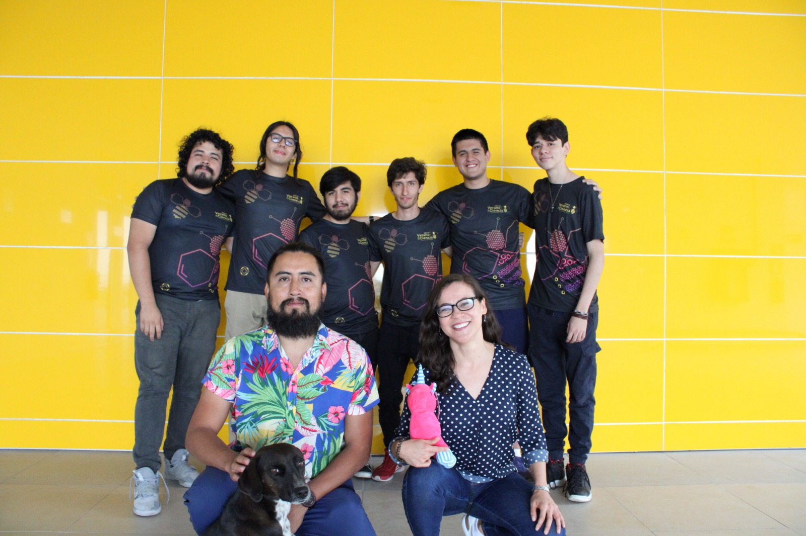

# Generación Procedural de Contenido 💻⚡

"La generación procedural de contenido tiene capacidades para crear diferentes tipos de elementos (texturas, mapas, música, terrenos, vegetación, etc.) a partir de procedimientos precisos que buscan automatizar lo más posible la producción y el ahorro de costos en industrias como la de los videojuegos. Estas técnicas juegan un papel fundamental que nos abre las oportunidades de experimentar con diversas propuestas de contenido que se adapten a diferentes sentimientos, procesos cognitivos y lúdicos, a través de un buen análisis previo formal. Gracias a la exploración de áreas tan diversas (vegetación con sistemas-L, terrenos, mapas navegables, estéticos y didácticos), pudimos no solo generar 6 aplicaciones interactivas con aplicaciones de algoritmos procedurales, sino que esto nos permitió ampliar el panorama, combinar diversas áreas y llegar a conclusiones similares que analizan las cualidades y áreas de oportunidad en las diferentes aplicaciones que existen en la generación procedural de contenido."

[Revisa el artículo completo :octocat: ](https://www.jovenesenlaciencia.ugto.mx/index.php/jovenesenlaciencia/article/view/3984/3470)

